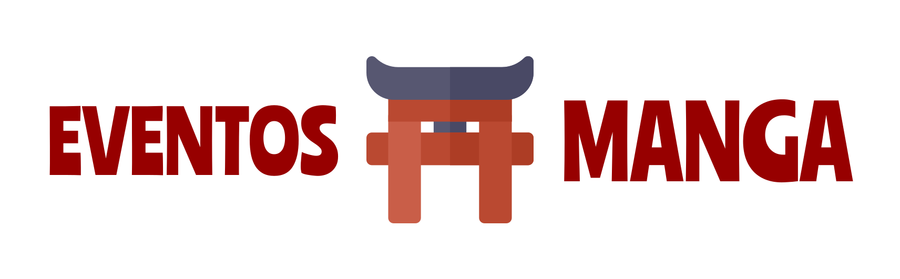

  
  <h3 align="center">Todos los eventos de manga y anime de España en un sólo lugar</h3>

## Descripción

Este proyecto tiene como objetivo crear una plataforma completa y actualizada donde **los fans del manga y el anime en España** puedan encontrar toda la información necesaria sobre eventos relacionados sobre la **cultura japonesa**: **convenciones, ferias, exposiciones, talleres**, etc. **Eventos Manga** servirá como punto de encuentro para la comunidad, **facilitando la asistencia a eventos** y **fomentando la interacción entre los aficionados**.

## Características
+ 📅 **Calendario de eventos**: Un calendario interactivo que muestre los eventos próximos y pasados, con filtros por fecha, ubicación, tipo de evento y temática.
+ 🎫 **Perfil de eventos**: Páginas dedicadas a cada evento con información detallada (fecha, hora, lugar, precio, actividades, invitados, etc.).
+ 🗺️ **Mapa interactivo**: En cada página del evento hay un enlace a la ubicación del evento en **Google Maps**.
+ 📱 **Diseño responsive**: La web estará diseñada para adaptarse a diferentes dispositivos (móviles, tablets, ordenadores), ofreciendo una experiencia de usuario óptima en cualquier plataforma.

## Tecnologías usadas
+ [**Astro**](https://astro.build) - Framework para desarrollar sitios Web basados en contenido
+ [**MDX**](https://mdxjs.com) - Permite utilizar contenido en JSX en archivos **Markdown**
+ [**React**](https://react.dev) - Librería para crear componentes Web
+ [**Full Calendar**](https://fullcalendar.io) - Calendario que permite mostrar eventos

**NOTA ADICIONAL:** Este sitio hace uso de la **API View Transitions** para las transiciones entre páginas, y se nota en las animaciones de los carteles de eventos.

**NOTA ADICIONAL 2:** Este sitio está actualizado a **Astro 6**, y hace uso de las [**Content Collections**](https://docs.astro.build/en/guides/content-collections/), la nueva API para cargar los eventos desde los **archivos Markdown**.

## Contribuciones
Este proyecto acepta cualquier tipo de contribución con el fin de mejorar la experiencia del usuario. Eso incluye el **añadir nuevos eventos** como mejoras de calidad. 
Si eres o perteneces a una empresa organizadora de eventos de manga y anime, no dudes en enviar una "issue" usando la plantilla de **"Nuevo evento"**, proporcionando la información que se pide en el formulario.

## Licencia
Este proyecto está distribuído bajo la **Licencia del MIT**. Lee el archivo `LICENSE` para más información.

## Contacto
Si quieres ponerte contacto conmigo, lo puedes hacer en estos enlaces:
+ [Email](mailto:santosalarcon86@gmail.com)
+ [LinkedIn](https://www.linkedin.com/in/santos-alarcon-asensio)
+ [Página Web](https://www.santosalarcon.es)
